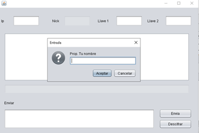

# Cifrado-mediante-Hardware-con token
## Metodo de cifrado con arduino y circuitos

- Lenguaje: java
- Arduino
- Circuito Integrado 74ls04
- PROTEUS Version: 8.11
- Librerias: PanamaHitek_Arduino-3.1.0, jssc-2.9.1

En el presente proyecto, se realizo una Aplicacion emulada de un circuito integrado con cifrado de hardware con arduino y cifrado por medio de token.

## Arduino con salidas correspondientes al circuito anterior.

## Emulación de un panel fisico.

## Salidas inversas a las ingresadas si es bit 1 negativa si es 0 positiva.

## Si es incorrecta la clave manda error e impide el acceso.

## Acceso en dado casod de proporcionar la clave

